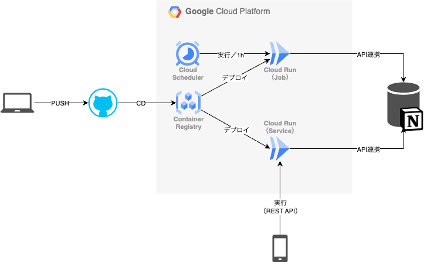

# 00_notion_api仕様書

## 1. 目次
- [1. 目次](#1-目次)
- [2. 用語](#2-用語)
- [3. 概要](#3-概要)
- [4. GCP構成イメージ](#4-gcp構成イメージ)
- [5. エンドポイント一覧](#5-エンドポイント一覧)
- [6. 機能一覧](#6-機能一覧)
  - [6.1. 【完了】実績集計マクロ](#61-完了実績集計マクロ)
  - [6.2. 【完了】Id自動付与機能](#62-完了id自動付与機能)
  - [6.3. 【完了】ID自動付与機能改修](#63-完了id自動付与機能改修)
  - [6.4. 【】空きリソースの計算機能](#64-空きリソースの計算機能)
  - [6.5. 【】今月の稼働計算](#65-今月の稼働計算)
  - [6.6. 【済】予定タスクの名前変更後、同一実績タスクの名前変更機能](#66-済予定タスクの名前変更後同一実績タスクの名前変更機能)
  - [6.7. 【】予定日を超えているタスクをステータス【遅延】に変更](#67-予定日を超えているタスクをステータス遅延に変更)
  - [6.8. 【】リマインド設定機能](#68-リマインド設定機能)
  - [6.9. 【済】残り工数計算マクロ](#69-済残り工数計算マクロ)
  - [6.10. 【】未完了タスク通知マクロ](#610-未完了タスク通知マクロ)
  - [【】APIトークンとDB\_IDを外だしする](#apiトークンとdb_idを外だしする)
- [7. 開発について](#7-開発について)
  - [7.1. 開発環境の構築](#71-開発環境の構築)
  - [ラベル追加回収時の対応方法](#ラベル追加回収時の対応方法)
- [8. 参考](#8-参考)

## 2. 用語

| 用語 | 説明 |
| ---- | ---- |
|名前ラベル or ネームラベル      | Notionのページタイトルに付与するラベル。[key-value]形式。|


## 3. 概要
本プロジェクトでは、Notion APIを操作するAPIサーバー を構築する。特定のGoogleアカウントで認証後、Notionのマクロ選択画面を表示し、選択したマクロを実行できるようにする。

## 4. GCP構成イメージ

- 本ツールは、GCPのCloud Runの`Service`と`Job`を使用して、Notion APIを操作するAPIサーバーを構築する。
  - Cloud Runの`Service`とは、APIリクエストを受けてから、コンテナが起動し、処理を実行するサービス
  - Cloud Runの`Job`とは、処理を定期実行するサービス 
- バージョン管理は、GitHubを使用
- GitGub Actionsを使用して、CDを実現
  - mainブランチにpushされたら、GCPのCloud Runにデプロイする

## 5. エンドポイント一覧

#### 5.2.1. 実績タスクに予定タスクのIDラベル付与

```bash
curl https://notion-api-454608-365326475377.asia-northeast2.run.app/update-excuted-task-id
```

#### 5.2.2. 工数計算

```bash
curl https://notion-api-454608-365326475377.asia-northeast2.run.app/update-man-days
```

## 6. 機能一覧

### 6.1. 【完了】実績集計マクロ

実績の合計をプロパティに付与

また、ラベルに実績を付与

### 6.2. 【完了】Id自動付与機能

実績タスクの名前と一致する予定タスクがあれば、実績タスクにIDを付与する

#### 3.2.1. 処理内容

1. 未完了の予定タスクを全て取得する
2. 予定タスク名を配列にいれる（タグ部分と頭と末尾の空白を除去）
3. 予定タスク名に一致する実績タスクを全て取得する
このとき、一回のクエリで全て取得する
4. 予定タスク名配列を回し、一致する実績タスクの名前にIDをタグとして付与する

### 6.3. 【完了】ID自動付与機能改修

#### 【完了】ID付与を先頭に[123]形式で付与へ変更
1. ID付与する関数を修正
#### 【完了】予定タスクにも自身のIDを付与するように

#### 【完了】その他タグは[⌛1.2/2.4]のように[絵文字+内容]形式に変更

- タグマネージャーに指定タグを含むか確認する関数実装
- 予定タスクを配列で回し、タグにSNを含むか確認
- タグがなければ、タグをセットし、アップデート
- その後、後続処理を実行

#### 【済】実績タスクがなくても、予定タスクにIDを付与するように変更

#### 【済】実績タスクがなくても、予定タスクに工数を付与するように変更

#### 予定タスクに

#### 【】取得するページの日数を過去一週間移行に変更する


### 6.4. 【】空きリソースの計算機能

- プライベートの空きリソース計算
- 仕事の空きリソース計算

（一週間で計算）

- 

### 6.5. 【】今月の稼働計算

ただし月単位で、タグ指定

### 6.6. 【済】予定タスクの名前変更後、同一実績タスクの名前変更機能

- 予定タスクを全件取得
- 予定タスクIDを名前に含む実績タスクを全件取得
- 予定タスクを回し、IDに一致する実績タスクを取得し、名前を確認、
名前が変わっていた場合、名前を予定タスクと同じに変更する。
4. 変更後updateする
- 

### 6.7. 【】予定日を超えているタスクをステータス【遅延】に変更

### 6.8. 【】リマインド設定機能

選択期間のタグのタスクの開始にリマインドを設定
もしくは、選択したIDのタスクに全てリマインドを設定

lineでリマインドを設定する

### 6.9. 【済】残り工数計算マクロ

残り工数をタイトルもしくはプロパティに付与

### 6.10. 【】未完了タスク通知マクロ

定期実行する・未完了のタスクを携帯にプッシュ通知

### 【】APIトークンとDB_IDを外だしする

## 7. 開発について

### 7.1. 開発環境の構築

1. 拡張機能をインストール
   - [Remote - Containers](https://marketplace.visualstudio.com/items?itemName=ms-vscode-remote.remote-containers)
   - [Docker](https://marketplace.visualstudio.com/items?itemName=ms-azuretools.vscode-docker)
2. `notion-api/docker-compose-yml`を開く
3. `Run Service`を選択
4. 左のタブ`Docker` > `Containers` > `notion-api`の折りたたみを開く
5. `notion-api`を右クリック > `Attach Shell`もしくは`Visual Studio Codeをアタッチする`を選択

### ラベル追加回収時の対応方法
1. ○○Labelクラスを追加する
2. NameLabelクラスの`parse_labels`メソッドのhandlersに1.で追加したクラスを追加する
3. TaskNameクラスの`__eq__`メソッドにラベルの比較処理を追加する


## 8. 参考

https://chatgpt.com/share/67d66038-0148-8001-9b2c-8f8f5c03c450